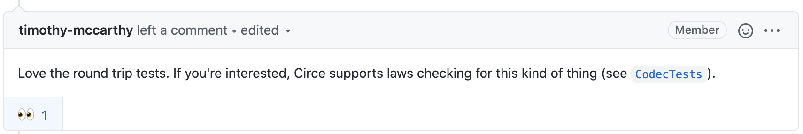

# Law Testing in Scala 👩🏽‍⚖️


## A simple test

```scala
"the deal id decoder" should {
    "decode an deal id" in {
        Json.fromInt(1).as[DealId] shouldEqual DealId(1)
    }
}

"the deal id encoder" should {
    "encode an deal" in {
        DealId(1).asJson shouldEqual Json.fromInt(1)
    }
}
```

- Could we make this better?

## Property based testing

- a quick recap ✈️
- defines a property
    - behaviour that must hold true for a set of values

## A to B ↔ B to A


## Optimised test 💡

```scala
def roundTripEncodeAndDecodeDealId =
    prop { (dealId: DealId) =>
      dealId.asJson.as[DealId] shouldEqual Right(dealId)
    }
```

- For every `dealId`, if we decode and encode it, we should get back the same `dealId`
- some implicit magic going on with `Arbitrary[DealId]`

## There's more 🌈



## Even more optimised test 🤓

```scala
def roundTripEncodeAndDecodeDealId =
    prop { (dealId: DealId) =>
      CodecLaws[DealId].codecRoundTrip(dealId)
    }
```

## Unpacking time 📦

- [CodecTests](https://github.com/circe/circe/blob/master/modules/testing/shared/src/main/scala/io/circe/testing/CodecTests.scala)

```scala
def codecRoundTrip(a: A): IsEq[Decoder.Result[A]] =
    encode(a).as(decode) <-> Right(a)

final case class IsEq[A](lhs: A, rhs: A)

implicit final class IsEqArrow[A](private val lhs: A) extends AnyVal {
    def <->(rhs: A): IsEq[A] = IsEq(lhs, rhs)
}
```

## Digression: extension methods

```scala
implicit final class IsEqArrow[A](private val lhs: A) extends AnyVal {
    def <->(rhs: A): IsEq[A] = IsEq(lhs, rhs)
}

// equivalent
final class IsEqArrow[A](private val lhs: A) {
    implicit def <->(rhs: A): IsEq[A] = IsEq(lhs, rhs)
}
```
<!-- TODO: add explanation for extension methods -->

## Resources

- [Intro to law testing](https://www.freecodecamp.org/news/an-introduction-to-law-testing-in-scala-4243d72272f9/)
- [Extension methods](https://alvinalexander.com/scala/implicit-extension-methods-functions-scala-2-3-dotty/)
