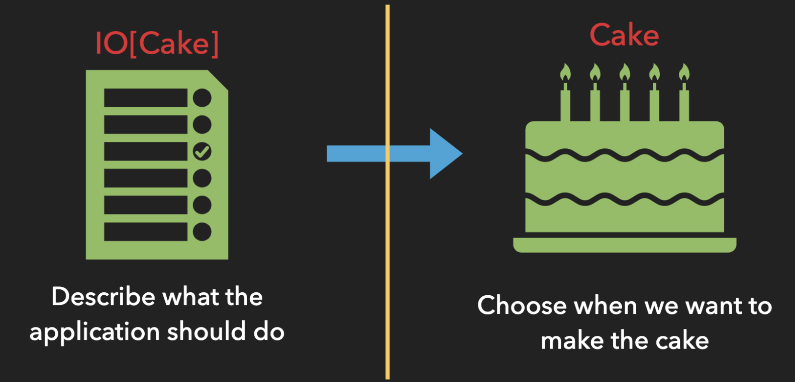

# Side Effects & IO 🥴

---

## "You don't write software that _does_ stuff, you write software that _describes_ stuff"

- FP Gurus everywhere 👨‍🏫👩‍🏫

---

## What are side effects?

- Writing / reading something to disk
- Calling out to an API

---

## Side effects pose some challenges 🧗🏽‍♀️

- Referentially transparent?
- When can they run?
- How do they run? i.e. sequential or parallel
- Be treated as values?

---

## Oh hey, I know

We can do that with the the 😸s Effect `IO`

---

## IO ⭐️

`IO[A]`

- when evaluated, it performs an effect and returns value of type `A`

---

## Constructing an IO

```
IO(side effect) OR IO.apply(side effect)
```

```
println("🍕")       => 🍕
IO(println("🌮"))   =>
```

---

## Why does this work?

- `IO` represents a _description_ of a side effectful computation



---

## Executing at end of the 🌏

```
val ioA: IO[Unit] = IO(println("🥨"))
ioA.unsafeRunSync => A
```

OR (preferably)

```
object Main extends IOApp
```
We'll see an example of this in the project
---

## What can we do with IO?

Transform from `IO[A]` to `IO[B]`

```
IO[A] + (A => B) = IO[B] // looks familiar 🤔
```

```
IO[A].map(A => B) = IO[B]
```

---

## map with IO

```
val io: IO[Int] = IO(4)
val newIO: IO[String] = io.map(i => s"Here are $io 🍎s")

newIO.unsafeRunSync() = "Here are 4 🍎s"
```

---

## What about chaining `IO`? 🔗

- Useful when performing a side effect and getting the result to perform another side effect

```
IO[A] + IO[B] = IO[B]

IO[A].flatMap(A => IO[B]) = IO[B]
```

```
IO(25).flatMap(n => IO(println(s"Number is: $n")))

A: Int, Int => IO[Unit]
```

---

## Launching Nukes 🚀

```
<!-- Imperative -->
val launchcode: Launchcode = getLaunchCodeFromUser()
launchTheNukes(launchcode)
<!-- sequencing of side effects is implicit -->
```

```
// Functional
val launchcode: IO[Launchcode] = getLaunchCodeFromUser()
launchcode.flatMap(code => launchTheNukes(code))
// sequencing of side effects is explicit
```

---

## flatMap with IO

```
val ioA: IO[Int] = IO(4)
val newIO: IO[String] = for {
    number <- ioA
    string <- IO(s"hello $number")
} yield string

newIO.unsafeRunSync() = "hello 4"
```

---

## Referential Transparency

An expression is referentially transparent if it can be replaced with its value without changing the program’s behavior.

---

## Is this RT?

```
val a = println("🥯")   val a = println("🥯")
val a = println("🥯")   b = a
```

```
// Output               Output
🥯                      🥯
🥯
```

---
## 🙅‍♀️
---

## What about this?

```
val a = println("🥯")               val a = println("🥯")
val a = println("🥯")               b = a

a.flatMap(_ => b).unsafeRunSync()   a.flatMap(_ => b).unsafeRunSync()
```

```
// Output                           Output
🥯                                  🥯
🥯                                  🥯
```

---
## ✅
---

## Signal failures

```
IO.raiseError(new Exception(???))
```
---

## Handle failures

```
IO.attempt

IO[A] => IO[Either[Throwable, A]]
```

```
val io = IO[Result] = // side effect

io.attempt.map {
    case Right => // handle success
    case Left => // handle error
}
```

---

## Questions?

---

## Resources
- 🐱s docs https://typelevel.org/cats-effect/datatypes/io.html
- Very interesting Reddit discussion https://www.reddit.com/r/scala/comments/8ygjcq/can_someone_explain_to_me_the_benefits_of_io/

---

Things left to talk about

- IO.pure
- Futue vs IO
- Lazy evaluation
