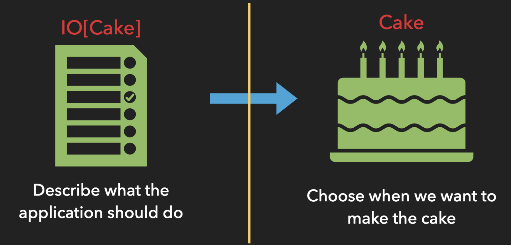

# Side Effects & IO 🥴

---

## "You don't write software that _does_ stuff, you write software that _describes_ stuff"

- FP Gurus everywhere 👨‍🏫👩‍🏫

---

## What are side effects?

- Writing / reading something to disk
- Calling out to an API

---

## Side effects pose some challenges 🧗🏽‍♀️

- Are side effects referentially transparent?
- When can we run them?
- How can we run them? i.e. sequential or parallel
- Can they be treated as values?

---

## Oh hey, I know

We can _all_ do that with 😸s Effect `IO`

---

## IO ⭐️

`IO[A]`

When evaluated, it performs an effect and returns value of type `A`

---

## Constructing an IO

```
IO(*side effect*) OR
IO.apply(*side effect*)
```

---

## Let's compare

```
println("🍕")       => 🍕
IO(println("🌮"))   =>
```

🥴 🥴 🥴 🥴 🥴 🥴 🥴 🥴 🥴

---

## Why does this work?

- `IO` represents a _description_ of a side effectful computation

```
def apply[A](body: => A): IO[A] = delay(body) *lazy evaluation*
```

---

## Executing at end of the 🌏

```
val ioA: IO[Unit] = IO(println("🥨"))
ioA.unsafeRunSync => A
```

```
object Main extends IOApp <!-- We'll see an example of this in the project -->
```



---

## Another construction of IO

- `IO.pure`
- This construction of IO should only be used for constants that we know are pure values

```
IO.pure(4)          <!-- nothing is executed -->
IO.pure("hello")    <!-- nothing is executed -->
```

---

## When not to use it

- IO.pure is _eagerly_ evaluated so it does not __suspend__ side effects
- `println` will be triggered immediately and this is probably not our intention

```
IO.pure(println("WRONG 🙅‍♀️"))
```

```
def pure[A](a: A): IO[A] *eager evaluation*
```

---

## Questions? 🌈

---

## What can we do with IO?

Transform from `IO[A]` to `IO[B]`

```
IO[A] + (A => B) = IO[B]
```

Looks Familiar 🤔

---

## What can we do with IO?

Transform from `IO[A]` to `IO[B]`

```
IO[A].map(A => B) = IO[B]
```

---

## map with IO

```
val io: IO[Int] = IO(4)
val newIO: IO[String] = io.map(i => s"Here are $io 🍎s")

newIO.unsafeRunSync() = "Here are 4 🍎s"
```

---

## What about chaining `IO`? 🔗

- Useful when performing a side effect and getting the result to perform another side effect

```
IO[A] + IO[B] = IO[B]

IO[A].flatMap(A => IO[B]) = IO[B]
```

```
IO(25).flatMap(n => IO(println(s"Number is: $n")))

<!-- A: Int, Int => IO[Unit] = IO[Unit] -->
```

---

## flatMap with IO

```
val ioA: IO[Int] = IO(4)
val newIO: IO[String] = for {
    number <- ioA
    string <- IO(s"hello $number")
} yield string

newIO.unsafeRunSync() = "hello 4"
```

---

## Launching Nukes 🚀

```
<!-- Imperative -->
val launchcode: Launchcode = getLaunchCodeFromUser()
launchTheNukes(launchcode)
<!-- sequencing of side effects is implicit -->
```

```
// Functional
val launchcode: IO[Launchcode] = getLaunchCodeFromUser()
launchcode.flatMap(code => launchTheNukes(code))
// sequencing of side effects is explicit
```

---

## Referential Transparency

An expression is referentially transparent if it can be replaced with its value without changing the program’s _behavior_.

---

## Is this RT?

```
val a = println("🥯")   val a = println("🥯")
val b = println("🥯")   b = a
```

```
// Output               Output
🥯                      🥯
🥯
```

---
## 🙅‍♀️ 🙅‍♂️
---

## What about this?

```
val a = IO(println("🍕"))           val a = IO(println("🍕"))
val b = IO(println("🍕"))           b = a

a.flatMap(_ => b).unsafeRunSync()   a.flatMap(_ => b).unsafeRunSync()
```

```
// Output                           Output
🍕                                  🍕
🍕                                  🍕
```

---
## ✅ 🎉
---

## Questions 🤚

---

## Side effects _may_ succeed 🤷‍♀️

- How does IO handle side effects that may not succeed?

---

## Signal failures

```
IO.raiseError(new Exception(???))

def raiseError[A](e: Throwable): IO[A]
```
---

## Handle failures

```
IO.attempt

def attempt: IO[Either[Throwable, A]]
```
---

## Example 🤓

```
val io = IO[Result] = // some side effect

io.attempt.map {
    case Right => // handle success
    case Left => // handle error
}
```

---

## Is IO the Future? 🤖

- `Future[A]` in Scala is like Promise in JS land
- Some problems with Future:
    - runs upon construction
    - Not referentially transparent
    - Not descriptive
    - It requires an `ExecutionContext` (a thread pool) upon construction

---

## Is IO the Future? 🤖
_It is one of the better / best options to work with side effects_

---

## Questions? 🧠

---

## Resources
- 🐱s [docs](https://typelevel.org/cats-effect/datatypes/io.html)
- Very detailed and interesting Reddit [discussion](https://www.reddit.com/r/scala/comments/8ygjcq/can_someone_explain_to_me_the_benefits_of_io/) on the benefits of IO

---

## Exercise time 🏃‍♀️ 🏃‍♂️
