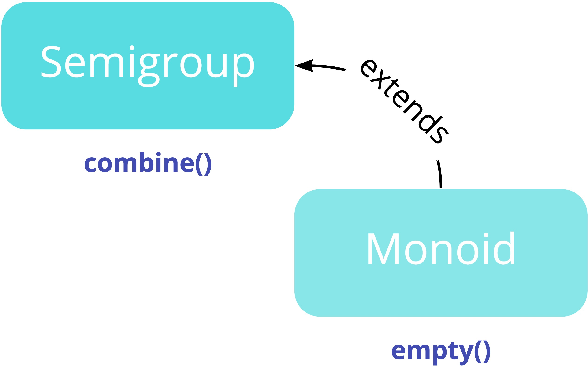

# Semigroup


---

## What it provides

- an associative binary operation 🤔

```scala
trait Semigroup[A] {
  def combine(x: A, y: A): A
}
```

---

## Associativity ➕

```scala
combine(x, combine(y, z)) = combine(combine(x, y), z)
```

---

## Example: Semigroup for Int

```scala
import cats.Semigroup

implicit val intAdditionSemigroup: Semigroup[Int] = new Semigroup[Int] {
  def combine(x: Int, y: Int): Int = x + y
}
```

---

## Example: Usage

```scala
Semigroup[Int].combine(1, 2)

Semigroup[Int].combine(1, Semigroup[Int].combine(2, 3))
```

---

## Already defined instances

- 🐱s provides many `Semigroup` instances out of the box
  - `Int`
  - `String`
  - `List`
  - `Set`
  - `Tuple`
- Can everthing be solved with the cats implicits import? 🧠

---

## New type

```scala
FruitInventory(total: Int) //value case class
```

- Will there be a Semigroup instance for these case classes?

---

## Defining a new type instance

```scala
import cats.kernel.Semigroup

case class FruitInventory(count: Int)

implicit val fruitInventorySemigroup: Semigroup[FruitInventory] = new Semigroup[FruitInventory] {
  def combine(x: FruitInventory, y: FruitInventory): FruitInventory = FruitInventory(x.count + y.count)
}

Semigroup[FruitInventory].combine(FruitInventory(11), FruitInventory(24))
```

---

## Exploiting laws

- must be associative
- e.g. summing a `List[Int]` we can do
  - 👉 `foldLeft()`
  - 👉 `foldRight()`
  - we can also split a list apart and sum the parts in parallel

---

## Associativity in List

```scala
val list = List(1, 2, 3, 4, 5)
val (left, right) = list.splitAt(2)
val sumLeft = left.foldLeft(0)(Semigroup.combine(_, _))
val sumRight = right.foldLeft(0)(Semigroup.combine(_, _))
val result = Semigroup.combine(sumLeft, sumRight)   // result: Int = 15
```

---

## Combine a generic List

```scala
def combineAll[A: Semigroup](as: List[A]): A =
  as.foldLeft(???)(Semigroup.combine(_, _))
```

- What should the _fallback_ or _default_ be for a generic list?

---

## Empty list?

```scala
def combineAll[A: Semigroup](as: List[A]): A =
  as.foldLeft(List.empty[A])(Semigroup.combine(_, _))
  // 🙅‍♀️ No implicits found for parameter ev: Semigroup[Any] 🙅‍♀️
```

- 💡 `Semigroup` does not give us an **identity** or **fallback** if the list is empty
- ✅ `Monoid` type class does

---

# Monoid


---

## What it provides

```scala
trait Monoid[A] extends Semigroup[A] {
  def empty: A
}
```

- an identity for the combine operation
- `combine(x, empty) = combine(empty, x) = x`

---



---

## Monoids in the wild 🐻

- Ints (with 0)
- Strings (with "")

```scala
import cats.Monoid

implicit val intAdditionMonoid: Monoid[Int] = new Monoid[Int] {
  def empty: Int = 0
  def combine(x: Int, y: Int): Int = x + y
}

Monoid[Int].combine(x, Monoid[Int].empty)   // 1
Monoid[Int].combine(Monoid[Int].empty, x)   // 1
```

---

## Revisit a previous constraint

```scala
def combineAll[A: Monoid](as: List[A]): A =
  as.foldLeft(Monoid[A].empty)(Monoid[A].combine)

combineAll(List(1, 2, 3))                   // res1: Int = 6
combineAll(List("hello", " ", "world"))     // res2: String = hello world
combineAll(List.empty[String])              // res3: String = ""
```

---

## What have we achieved so far

- ✅ We can combine defined types with `Semigroup`
- ✅ We can combine empty types with `Monoid`
- ...can we combine non-optional types with what we have ❓
  - e.g. `NonEmptyList`
  - `NonEmptyList` type forms a semigroup through `++`
  - what is the identity element?

---

## Option monoid

- Can be used to collapse `List[NonEmptyList[A]]`

```scala
def empty: Option[A] = None

def combine(x: Option[A], y: Option[A]): Option[A] = // look in OptionInstances.scala
```

- There is a `Monoid[Option[A]]`

---

## Revising the data structures 🤓

```scala
import cats.{ Semigroup, Monoid }
import cats.data.NonEmptyList

val myList: List[NonEmptyList[Int]] =
    List(NonEmptyList(1, List(2, 3)), NonEmptyList(4, List.empty[Int]))
val lifted: List[Option[NonEmptyList[Int]]] =
    myList.map(nel => Option.apply(nel))
Monoid.combineAll(lifted)           // Some(NonEmptyList(1, 2, 3, 4))

Semigroup.combineAllOption(myList)  // Some(NonEmptyList(1, 2, 3, 4))
```

---

## Resources

- [Semigroup](https://typelevel.org/cats/typeclasses/semigroup.html)
- [Monoid](https://typelevel.org/cats/typeclasses/monoid.html)
